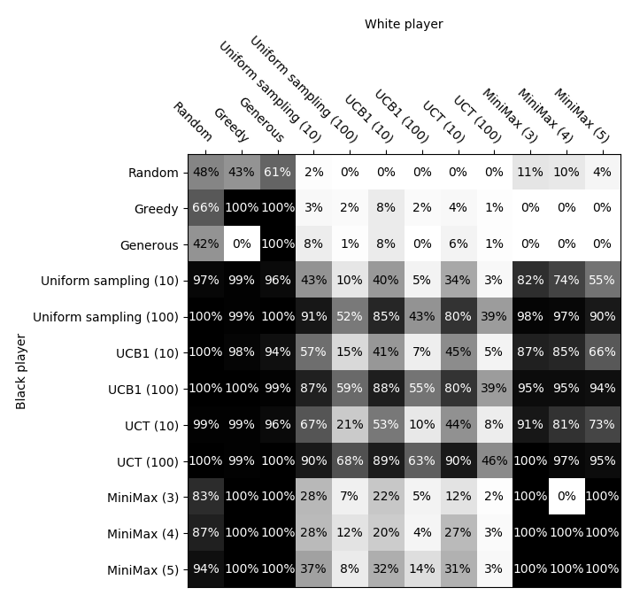

# mcts-reversi

Reversi (othello) AI experiments in C++

Implemented algorithms:
- Minimax / alpha-beta pruning
- UCB1 (bandit algorithm)
- UCT (i.e. monte-carlo tree search)

## Tournament 

Inspired by tom7's [chess algorithm adventures](http://tom7.org/chess/) (and as a sanity check on my implementations), I run the strategies against each other in a head-to-head tournament to evaluate them.

### Setup

Each strategy plays 100 games against every other strategy as black, and again as white. 
Win rates for black are plotted below.

### Players 

- Random: chooses a random valid move. 
- Greedy: chooses the move which will convert the most pieces.
- Generous: chooses the move which will convert the *least* pieces.
- Uniform sampling (n): for each valid move, plays _n_ random games and chooses the move resulting in the most wins. 
- UCB1 (n): plays a total of _n_ times _number of valid moves_ games, but distributes the games over the valid starting moves using the [UCB1 bandit algorithm](https://docs.microsoft.com/en-us/archive/msdn-magazine/2019/august/test-run-the-ucb1-algorithm-for-multi-armed-bandit-problems). (i.e. each valid move is an arm on a multi-armed bandit).
- UCT (n): implements the upper confidence bound for trees ([UCT](https://en.wikipedia.org/wiki/Monte_Carlo_tree_search)) algorithm. Simulates a total _n_ times _number of valid moves_ games.
- MiniMax (d): Deterministic tree search using the Minimax algorithm with alpha-beta pruning. Evaluates the game tree to depth _d_ at each step. Leaves are valued counting the number of pieces on the board.

## Results

We see a logical progression in winrates with the complexity of the stochastic methods, from uniform sampling to UCB1 to UCT. 

Strangely, the worst strategy (generous) managed one win in 100 games against the best (UCT 100).

Note: MiniMax, Greedy, and Generous are fully deterministic, so results between them reflect only one played game.